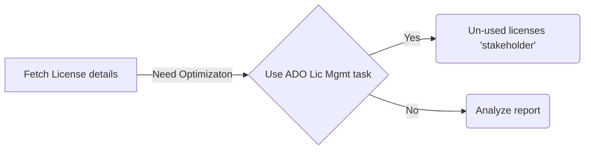

#  Azure DevOps User License Management


####  Author - Aammir Mirza


Use to manage Azure DevOps License accross the platform. You can easyly track number and type of licenses accross the platform. It details you with UPNs to whome which type of license is assigned.


Extension takes a close look at the number of Visual Studio Team Services subscribers in the organization and make sure that entitles users actively using their license with the last access date.


<span  style="background-color: #83DFBE">With entitlemen changes _(Changing un-used Azure DevOps licences to STAKEHOLDER)_ the cost can be reduced for _Basic and Basic + Test_ user licenses.


This can be easyly achieved with the respective task [ADO License Management](https://marketplace.visualstudio.com/items?itemName=AammirMirza.CP-ADOLicenseManagementpublic)


You can run the task accross all the organization that is scoped within your PAT.</span>


##  Platform


* Windows *Provides logs file features that can be artifact*

* Linux


##  Installation


Download the Free _'Azure DevOps Licenses Tasks'_ from [here](https://marketplace.visualstudio.com/items?itemName=AammirMirza.CP-AzureDevOpsLicenses) and populate the below mentioned mandatory parameters to get it working

Available task name after installation - 'Azure DevOps Licenses'


##  Configuration


###  Classic Pipeline (UI)


* Generate PAT token for All accessible orgs. This token you will be using across all orgs for cost savings extension.
* Adding the extension using classic pipeline (UI-Based pipeline in AzDO)

-- AccessToken pass token PAT that you have generated for all org, passing it as masked pipeline variable

* Logs (csv) availble for artifact packaging as .CSV. Available output in pipeline artifact `(Limited feature for windows agent)`.

####  Minimum required previlages for the token to perform the task

* Members Entitlement Management (Read)

##  Operation arguments

Available command line options are:

*  **`AccessToken`** Authentication token used in client auth. This token need to be generated for 'All Organization' in case of multiple organizations.
####  YAML Usage

```yaml

steps:

-  task:  AammirMirza.CP-AzureDevOpsLicensespublic.AzureDevOpsLicenses-Task.AzureDevOpsLicenses@1
	displayName:  "Azure DevOps License"
	inputs:
		AccessToken:  "$(atokent)"
# Below task added for packaging the generated log as build artifacts ONLY FOR WINDOWS BUILD AGENT

-  task:  PublishBuildArtifacts@1
	displayName:  'Publish Artifact: completon_log'
	inputs:
		ArtifactName:  'completon_log'
```

##  Success story


##  GIF for reference
Placeholder

##  Required previlages for PAT
* Members Entitlement Management (Read & Write)

##  Contributing

Pull requests are welcome. For major changes, please open an issue first to discuss what you would like to change.
Please make sure to update tests as appropriate.

##  Limitation

* Cannot change licenses or extensions inherited through group rules.
* Organization admin cannot be downgraded to stakeholder license.

##  License
[MIT](https://choosealicense.com/licenses/mit/)


##  Support

emailto: aammir.mirza@hotmail.com

Produce a flow chart:
