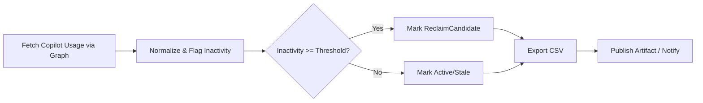

# O365 Copilot License Optimization (Azure DevOps Task)

Optimize allocation and utilization of Microsoft 365 (O365) Copilot licenses by identifying inactive / low‑usage users and generating actionable reports for cost reduction.

---

## Why This Task

Copilot licenses are premium. Unused or rarely used assignments = waste. This task:
- Pulls Copilot activity signals (Last activity per workload: Word, Excel, PowerPoint, Outlook, Teams, OneNote, Loop, Chat).
- Correlates licensing vs recent usage.
- Produces CSV report for re-harvesting / re-assignment decisions.
- Enables automation in Azure Pipelines (scheduled governance job).

---

## Key Features

| Capability | Description |
|------------|-------------|
| Usage Harvest | Aggregates per-user last activity across supported Copilot surfaces. |
| Inactivity Detection | Flags users with no activity in X days (configurable). |
| Export | CSV with readable column headers for BI / Excel review. |
| Multi-Tenant Ready | Works against all tenants accessible to the provided token (if permitted). |
| Pipeline Friendly | Windows & Linux agents (PowerShell 7 recommended). |

---

## Output Columns (Sample)

| Column | Meaning |
|--------|---------|
| Report Refresh Date | Snapshot date (UTC). |
| User Principal Name | Licensed user's UPN. |
| Display Name | Directory display name. |
| Last Activity Date | Most recent Copilot interaction (any workload). |
| <Workload> Copilot Last Activity | Per surface (Word / Excel / PowerPoint / Outlook / OneNote / Loop / Teams / Chat). |
| Activity Period Detail | Raw period detail (if API returns period expansion). |
| Inactive Days | Computed difference (today - last activity). |
| Status Flag | Active / Stale / ReclaimCandidate (threshold based). |
| RevokeLicense | Yes/No flag indicating candidate for reclaim based on policy. |

(Exact fields depend on Graph response set/version.)

---

## Sample Output (Excerpt)

Blank cells = no recorded activity in the reporting window.

| Report Refresh Date | User Principal Name        | Last Activity Date | Display Name | Copilot Chat Last Activity | Teams Copilot Last Activity | Word Copilot Last Activity | Excel Copilot Last Activity | PowerPoint Copilot Last Activity | Outlook Copilot Last Activity | OneNote Copilot Last Activity | Loop Copilot Last Activity | Activity Period Detail | RevokeLicense |
|---------------------|----------------------------|--------------------|--------------|----------------------------|-----------------------------|----------------------------|------------------------------|----------------------------------|------------------------------|-------------------------------|----------------------------|-----------------------|---------------|
| 26/09/2025          | User2@organization.com     |                    | User1        |                            |                             |                            |                              |                                  |                              |                               |                            | 180                   | Yes           |
| 26/09/2025          | User1@organization.com     |                    | User2        |                            |                             |                            |                              |                                  |                              |                               |                            | 180                   | Yes           |
| 26/09/2025          | User3@organization.com     | 23/06/2025         | User3        | 14/05/2024                 | 24/05/2025                  | 21/01/2025                 | 16/04/2024                   | 23/06/2025                       | 11/04/2025                   |                               |                            | 180                   | Yes           |
| 26/09/2025          | User2@organization.com     |                    | User4        |                            |                             |                            |                              |                                  |                              |                               |                            | 180                   | Yes           |
| 26/09/2025          | User1@organization.com     | 26/06/2025         | User5        |                            | 26/06/2025                  |                            |                              | 16/06/2025                       |                              |                               |                            | 180                   | Yes           |
| 26/09/2025          | User3@organization.com     | 27/06/2025         | User6        | 12/05/2025                 | 04/06/2025                  |                            | 27/06/2025                   |                                  |                              |                               |                            | 180                   | Yes           |
| 26/09/2025          | User2@organization.com     | 23/07/2025         | User7        | 23/07/2025                 |                             |                            |                              |                                  | 23/07/2025                   |                               |                            | 180                   | Yes           |
| 26/09/2025          | User1@organization.com     |                    | User8        |                            |                             |                            |                              |                                  |                              |                               |                            | 180                   | Yes           |

---

## Prerequisites

| Item | Requirement |
|------|-------------|
| Azure AD App or Managed Identity | Permission to read usage reports. |
| Microsoft Graph Permissions | Reports.Read.All (delegated) OR Reports.Read.All (application). |
| PowerShell Modules (local runs) | Microsoft.Graph (if calling Graph directly). |
| PAT (Azure DevOps) | Only needed for pipeline artifact publishing (System.AccessToken). |

---

## PAT / Auth Notes

This task itself (inside the extension) should use Microsoft Graph auth (client secret / certificate or delegated token). Ensure secrets are stored as secure pipeline variables or in a variable group backed by a Key Vault.

---

## YAML Usage (Example)

```yaml
steps:
- task: O365CopilotLicenseOptimization-Task@1
  displayName: "O365 Copilot License Optimization Scan"
  inputs:
    TenantId: '$(TENANT_ID)'
    ClientId: '$(APP_CLIENT_ID)'
    ClientSecret: '$(APP_CLIENT_SECRET)'   # mark secret
    InactivityThresholdDays: '30'
    OutputCsvPath: 'CopilotUsageReport.csv'

# Optional: publish the CSV
- task: PublishBuildArtifacts@1
  displayName: "Publish Copilot Report"
  inputs:
    PathtoPublish: 'CopilotUsageReport.csv'
    ArtifactName: 'copilot-usage'
```

---

## Classic (UI) Setup

1. Add the task to a pipeline.
2. Provide authentication mode + credentials.
3. Set inactivity threshold (e.g., 30 / 45 / 60 days).
4. Enable artifact publishing to capture the CSV.

---

## Interpreting Results

| Status Flag | Action |
|-------------|--------|
| Active | Keep assigned. |
| Stale | Monitor—approaching reclaim threshold. |
| ReclaimCandidate | Consider removal / pool re-assignment. |

Define thresholds internally (e.g., Stale ≥21 days inactivity, ReclaimCandidate ≥30).

---

## Suggested Governance Flow

1. Nightly / Weekly pipeline run.
2. Produce CSV + push to central storage (Artifacts / Blob / SharePoint).
3. Optional: Auto-create ticket / send email for ReclaimCandidates > N.
4. After approval, revoke / unassign Copilot license centrally.
5. Track reclaimed license count as KPI.

---

## Sample Post-Processing (PowerShell)

```powershell
$rows = Import-Csv CopilotUsageReport.csv
$reclaim = $rows | Where-Object { $_.'Status Flag' -eq 'ReclaimCandidate' }
$reclaim | Export-Csv reclaim-targets.csv -NoTypeInformation
```

---

## Security Considerations

| Area | Guidance |
|------|----------|
| Secrets | Use secure variables; never commit secrets. |
| Principle of Least Privilege | Grant only Reports.Read.All. |
| Logging | Avoid writing raw tokens to logs. |
| Data | Treat usage output as internal-only (contains user identifiers). |

---

## Troubleshooting

| Symptom | Possible Cause | Resolution |
|---------|----------------|-----------|
| Empty CSV | Missing permission or no activity window data | Verify Reports.Read.All and correct API endpoint. |
| 401 / 403 | Invalid client secret / expired consent | Re-grant admin consent in Entra ID. |
| Date columns blank | Graph endpoint throttled / partial response | Re-run; add retry logic (future enhancement). |
| Task fails in Linux agent | Legacy Windows-only path usage | Ensure script paths are POSIX compatible. |

---

## Roadmap

- Teams chatbot integration
- Auto email to inactive users before reclaim
- Cost savings estimator
- Delta mode (only changes since last run)
- Integration with ServiceNow / Jira for reclaim workflows

---

## Contributing

Issues & PRs welcome. Please describe scenario and attach anonymized sample output if reporting parsing issues.

---

## License

MIT (unless superseded internally).

---

## Support

Open an issue or email: aammir.mirza@hotmail.com

---

## High-Level Flow (Mermaid)



---
